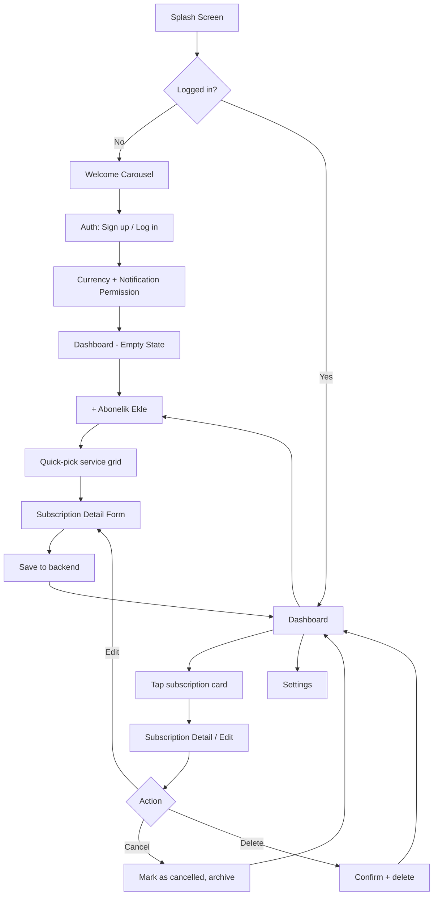
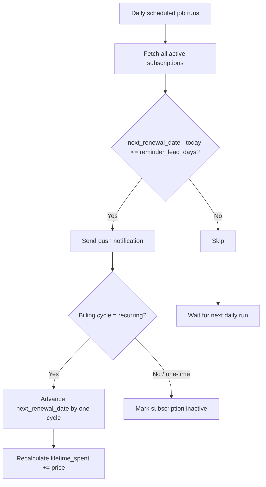
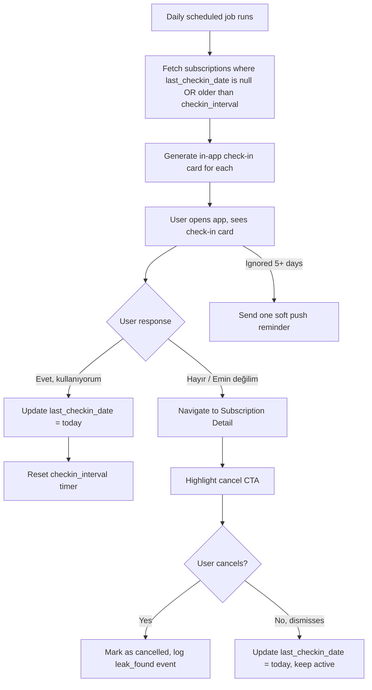
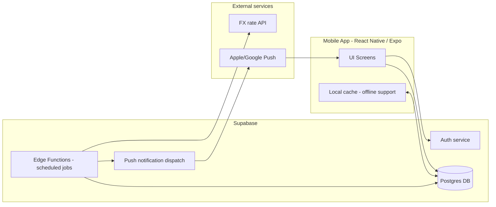
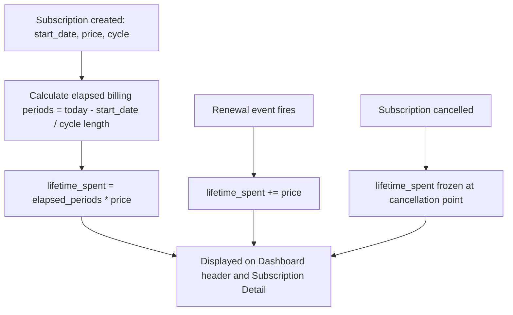

# Flowcharts

These are written in Mermaid syntax. Paste into any Mermaid renderer (GitHub markdown preview, mermaid.live, or Claude Code's own preview) to view visually. Antigravity/Claude Code can also read these directly as build logic references.

## 1. App navigation flow

## 2. Renewal reminder logic (backend/scheduled job)

## 3. "Still using this?" leak-detection logic (the core differentiator)

## 4. High-level system architecture

## 5. Data flow for lifetime-spend calculation

